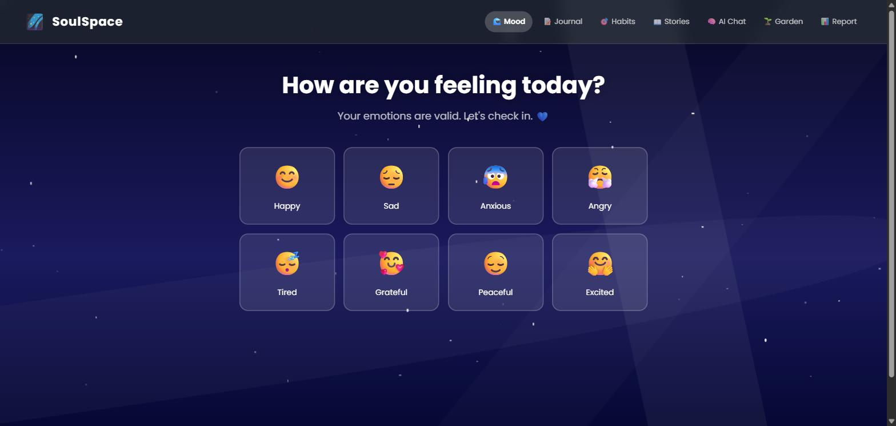

# SoulSpace 🌌

A mental wellness app built as a safe space to check in, reflect, and build healthier habits — one day at a time. SoulSpace pairs mood tracking with journaling, gamified habit-building, an AI-style companion chat, a "growth garden" that visualizes your progress, and weekly wellness reports.

**Live demo:** https://incredible-cendol-277541.netlify.app/



## Features

- **Mood check-ins** — log how you're feeling with a calm, ocean-animated home screen
- **Journal** — a private space to write and reflect
- **Habit battles** — gamified habit tracking that turns consistency into a game
- **AI companion chat** — a therapeutic-style chat companion for support between check-ins
- **Growth garden** — a visual representation of your progress that grows as you build habits
- **Weekly reports** — a summary of mood trends and habit progress over time

## Tech stack

- [React](https://react.dev/) (Create React App)
- [React Router](https://reactrouter.com/) for client-side navigation between Mood, Journal, Habits, Stories, AI Chat, Garden, and Report views
- `localStorage` for persisting mood logs, journal entries, and habit progress on-device (no backend required)

## Running it locally

```bash
git clone https://github.com/talk2brownn/Soulspace.git
cd Soulspace
npm install
npm start
```

The app will open at `http://localhost:3000`. All data is stored locally in your browser via `localStorage` — nothing leaves your machine.

## Author

Built by [Emediong "Brown" Ubong Ekwere](https://github.com/talk2brownn) — see more projects on my [portfolio](https://testingreactt.netlify.app/).

---

*SoulSpace is a personal project and not a substitute for professional mental health care. If you're struggling, please reach out to a licensed professional or a crisis line in your area.*
